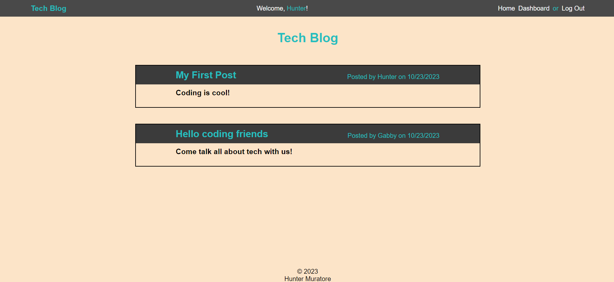

# Tech Blog Web App

Link to deployed app:
><https://floating-waters-36483-8b92f773fdcc.herokuapp.com/>

## Description

This is a full-stack app that allows users to register and login to an account. 
Once looged in, a user can create blog posts from their dashboard which will display on the homepage of the app for all users to see.
Users can update and delete their blog posts and interact with blog posts from other users as well.

## Table of Contents

- [Description](#description)
- [Usage](#usage)
- [License](#license)
- [Questions](#questions)

## Usage

This app can be used as a tech forum to interact with other users through posts and comments.

## License

This project is under the license of MIT.

## Questions

GitHub account:

>[https://github.com/HunterMuratore](https://github.com/HunterMuratore)

Reach me through email here to ask any questions about the app!

>Email: [muratoreh@gmail.com](mailto:muratoreh@gmail.com)
